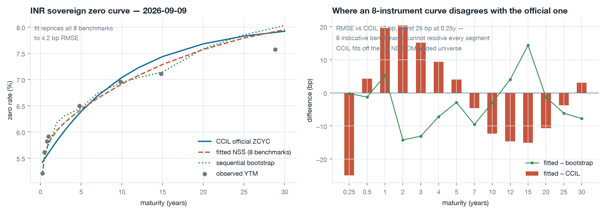
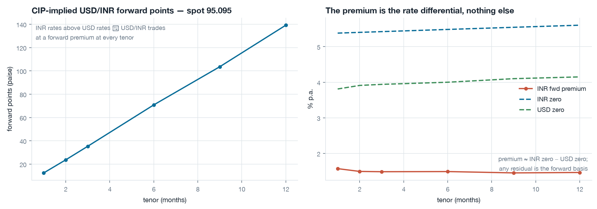
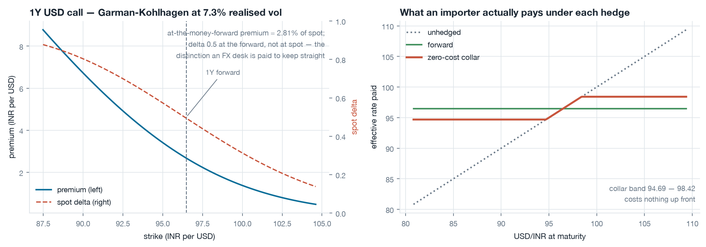
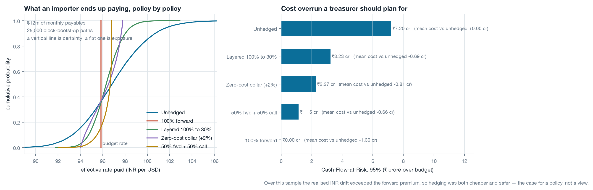
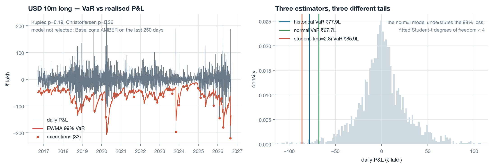
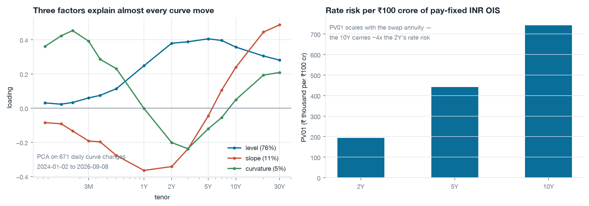

# INR Markets Desk

A working analytics toolkit for the Indian rates and FX markets: it builds the sovereign
zero-coupon curve from live CCIL data, prices the USD/INR forward and option book off it,
runs a corporate hedging desk's policy comparison, and measures the resulting risk with
VaR and Expected Shortfall that are actually backtested.

Everything runs on **public, live market data**. No paid terminal, no synthetic prices,
nothing hard-coded — the numbers quoted below were produced by `scripts/run_analysis.py`
and are re-derived on every run.

```bash
uv venv --python 3.12 .venv && source .venv/bin/activate
uv pip install -r requirements.txt
python scripts/run_analysis.py     # pulls live data, writes 8 figures + results.json
streamlit run app.py               # interactive desk dashboard
pytest -q                          # 35 tests
```

---

## Why this project

An Indian bank's Markets Group does four things over and over: it **builds a curve**, it
**prices something off that curve**, it **sells a hedge to a corporate client**, and it
**reports what could go wrong**. This repository implements one honest version of each,
end to end, on real data, with the trade-offs written down rather than assumed away.

---

## 1. Building the INR sovereign curve

**Data.** CCIL publishes end-of-day indicative YTMs for the most liquid T-Bills, G-Secs
and state development loans, and separately publishes the six Nelson-Siegel-Svensson
parameters of the *official* zero-coupon sovereign rupee yield curve. That second series
is what makes this project checkable: we fit our own curve to the traded yields and then
compare it, tenor by tenor, against the benchmark the whole market marks to.

**Method.** T-Bill yields are converted on India's simple money-market basis; dated
securities are stripped into semi-annual cash flows. NSS parameters are then calibrated
by multi-start least squares on **yield** errors rather than price errors, so a 30-year
bond does not drown out a 3-month bill. A classical sequential bootstrap is implemented
alongside as an independent control.

**Result** (2026-09-09, 8 benchmark instruments):

| check | value |
|---|---|
| repricing error across all 8 inputs | **4.2 bp RMSE**, 8.1 bp worst |
| our curve vs CCIL's official ZCYC | **13.4 bp RMSE**, 24.9 bp worst |
| parametric fit vs sequential bootstrap | 7.9 bp RMSE |
| 1Y / 10Y zero, 1s10s slope | 5.60% / 7.04%, **+144 bp** |



**The interesting failure.** Left unconstrained, the fit pins `tau1` on its lower bound and
collapses `beta2` to zero. The *curve* is still good — that is what the 4.2 bp repricing
error says — but the *parameters* are not, because with only eight instruments the
`(beta2, tau1)` hump is almost perfectly collinear with the `(beta3, tau2)` one. That
matters the moment anyone reads economic meaning into the betas, which is exactly what a
level/slope/curvature risk report does. `fit_nss` therefore takes `tau_bounds` and an
optional ridge penalty toward a prior (yesterday's parameters, or CCIL's own), trading a
little repricing accuracy for parameters that are comparable across days. Both fits are
reported so the cost is visible rather than hidden.

**State development loans.** SDLs carry no explicit central-government guarantee, and the
market prices that: at the same maturity they yield materially more than the sovereign
zero curve (`reports/figures/02_sdl_spread.png`, spreads recomputed live).

---

## 2. Pricing the USD/INR forward curve

The forward is not a forecast. Covered interest parity fixes it:

$$F(T) = S \cdot \frac{DF_{USD}(T)}{DF_{INR}(T)}$$

Because INR rates sit above USD rates, USD/INR trades at a forward premium at every tenor.
Built from the CCIL curve against the US Treasury par curve:

| tenor | forward | points (paise) | premium (% p.a.) |
|---|---|---|---|
| 1M | 95.2195 | 12.5 | 1.57 |
| 3M | 95.4480 | 35.3 | 1.49 |
| 6M | 95.8031 | 70.8 | 1.49 |
| 12M | 96.4867 | 139.2 | 1.46 |



The premium curve is the rate differential and nothing else. Any gap between this fair
value and a traded forward is the **forward basis** — and on USD/INR that gap is
informative, not noise: it moves with RBI's own forward-book intervention, with FCNR(B)
maturities, and with onshore dollar funding stress. `implied_basis_bp()` computes it
directly once you feed in a traded quote.

---

## 3. Options and structures

Garman-Kohlhagen with full greeks, implied-vol inversion, and the two structures Indian
corporates actually buy. At the 1-year tenor and 7.3% realised volatility:

- at-the-money-forward USD call: **2.81% of spot**
- zero-cost collar, cap 2% above the forward: band **94.69 – 98.42**, cost **zero**



The delta curve on the left panel is there for a reason: an ATM-*forward* call is 0.5
delta, an ATM-*spot* call is not, and on a currency with a 1.5% forward premium that
distinction is worth real money on a large ticket.

---

## 4. The hedging desk: five policies, one set of paths

A $1m-per-month importer over twelve months. Paths are generated by **block bootstrap** of
ten years of realised USD/INR daily returns — which keeps the volatility clustering and the
sharp-depreciation/slow-appreciation asymmetry that a lognormal model erases — and every
policy is scored on the same 25,000 paths.

The metric is **Cash-Flow-at-Risk**: the 95th-percentile rupee cost *in excess of the
budget rate*. That is a number a CFO can sign off on; variance is not.

| policy | mean rate | P95 rate | CFaR 95% (₹ cr) | vol reduction | mean cost vs unhedged (₹ cr) |
|---|---|---|---|---|---|
| Unhedged | 96.93 | 101.85 | 7.20 | — | 0.00 |
| Layered 100%→30% | 96.36 | 98.54 | 3.23 | 55.8% | −0.69 |
| Zero-cost collar (+2%) | 96.26 | 97.74 | 2.27 | 59.0% | −0.81 |
| 50% forward + 50% call | 96.38 | 96.80 | 1.15 | 78.7% | −0.66 |
| 100% forward | 95.85 | 95.85 | **0.00** | 100% | **−1.30** |



**Read the last column carefully.** Full hedging came out both *cheaper on average* and
*certain* — which sounds like a free lunch and is not one. It is a statement about this
sample: over the last decade the realised INR depreciation exceeded the forward premium,
so the forward has been systematically cheap relative to what actually happened. A
bootstrap inherits that drift. Re-run with `simulate_paths(..., drift_pct=0)` and the
ranking reverts to the textbook one, where certainty costs the premium. The honest
conclusion is the boring one: this is an argument for having a hedging *policy*, not for
holding a view on the rupee.

---

## 5. Risk

A USD 10m long position, 10 years of daily P&L (2,600 observations):

| estimator | 99% 1-day VaR | Expected Shortfall |
|---|---|---|
| historical | ₹77.9 lakh | ₹112.3 lakh |
| normal (variance-covariance) | ₹67.7 lakh | ₹77.7 lakh |
| Student-t (ν = 2.8 fitted) | **₹85.9 lakh** | ₹136.8 lakh |

FRTB-style ES at 97.5%: ₹84.4 lakh. Worst single day in the sample: −₹220 lakh.

The Gaussian model understates the 99% loss by **21%** against the fitted Student-t, and
the fitted degrees of freedom below 3 say why: USD/INR returns are not close to normal,
and the variance-covariance shortcut is exactly wrong in the region a risk number exists
to describe.

**Backtest** of a RiskMetrics EWMA (λ = 0.94) 99% VaR over the full 2,600 days:

| test | result |
|---|---|
| exceptions | 33 vs 26 expected (1.27%) |
| Kupiec proportion-of-failures | LR 1.75, **p = 0.19** — not rejected |
| Christoffersen independence | LR 0.85, **p = 0.36** — no clustering |
| joint conditional coverage | p = 0.27 |
| Basel zone, last 250 days | AMBER |



Both tests pass, which is the point of running them: an unbacktested VaR is decoration.
The AMBER zone on the most recent window is a genuine signal, not a bug — it reflects a
real volatility regime shift in the last year that a 0.94 decay is slow to absorb.

**Curve risk.** PCA on 671 daily US Treasury curve changes recovers the canonical three
factors — level (76% of variance, 12.4 bp daily vol), slope (11%), curvature (4.5%) — with
the textbook loading shapes. `key_rate_dv01` and `factor_shock_pnl` turn those into a
hedgeable risk report; PV01 on a ₹100 crore pay-fixed INR OIS runs ₹1.94 lakh at 2 years
to ₹7.43 lakh at 10.



---

## What this deliberately does not claim

- **Eight instruments is not the traded universe.** CCIL fits its official curve off all of
  NDS-OM. The 13 bp gap is the honest cost of working from published indicative benchmarks,
  and it is reported rather than tuned away.
- **Dated-security maturities are approximated** to mid-year where CCIL publishes only the
  maturity year. The resulting tenor error is under six months at the long end and is
  documented in `imd/data/ccil.py`.
- **Square-root-of-time VaR scaling assumes i.i.d. returns**, which the EWMA section itself
  shows is false. It is used because it is the regulatory convention, not because it is right.
- **Options are priced on a flat volatility.** USD/INR has a real smile; without a live
  quoted surface the flat-vol number is a fair-value indication, not a tradeable price.
- **CCIL exposes only two business days** of ZCYC parameters, so INR curve *history* has to
  be accumulated — `scripts/snapshot.py` appends daily. The PCA above therefore runs on the
  US Treasury curve, which has usable public history, and is presented as a proxy factor
  model rather than as an INR estimate.

---

## Repository layout

```
src/imd/
  data/        CCIL, US Treasury, NY Fed and Yahoo adapters, with a retrying disk cache
  curves/      NSS, instruments, bootstrapping, calibration, the ZeroCurve object
  pricing/     CIP forwards, Garman-Kohlhagen, collars and seagulls, INR swaps
  risk/        VaR/ES estimators, Kupiec and Christoffersen backtests, curve PCA
  hedging/     exposure schedules, hedge policies, path simulation, policy scoring
scripts/       run_analysis.py (full pipeline), snapshot.py (daily curve history)
app.py         Streamlit desk dashboard
tests/         35 tests — arbitrage identities, not regression snapshots
reports/       figures + results.json, regenerated by every run
```

## Data sources

| source | what | endpoint |
|---|---|---|
| CCIL | official ZCYC NSS parameters | `ccilindia.com/zcyc-parameters` |
| CCIL | indicative T-Bill / G-Sec / SDL yields | `ccilindia.com/tenorwise-indicative-yields` |
| US Treasury | daily par yield curve | `home.treasury.gov` daily rates CSV |
| NY Fed | SOFR | `markets.newyorkfed.org` |
| Yahoo Finance | USD/INR, DXY spot history | public chart endpoint |

## Tests

`pytest -q` — 35 tests. They check arbitrage relations rather than stored outputs:
put-call parity, forward-rate consistency of discount factors, that a bootstrap reprices
every input exactly, that a par swap has zero NPV, that a zero-cost collar costs zero,
that Kupiec rejects a mis-calibrated model and Christoffersen catches clustered exceptions,
and that PCA recovers a pure level factor from a parallel-shifting synthetic curve.

## Licence

MIT.
